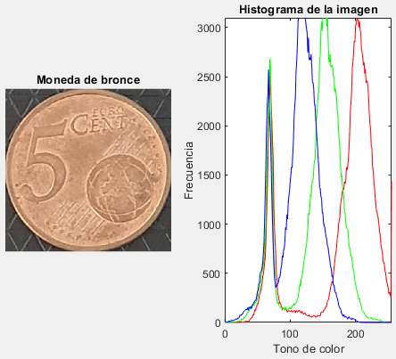

# coins-detection
This project will try to detect every type of euro coin within an image using just Computer Vision techniques (avoiding ML or DL just for didactic purposes).

## Overview
We will try to detect the amount of money within a euro coins image like this one:

Each image should be from above, with at least two coins, and them could be facing either heads or tails but they should not be overlapping each other.

## Methodology
We are going to go through preprocess steps to achieve a better image to detect. We will use the size and color of the coins to classify them:

### Size classification

We start by preprocessing the image, first step, binarizing it:

Then, we will apply dilate and erode (in that specific order) to remove salt and pepper noise in our image:

Now we are ready to use regionprops, a function from Image Processing library for regions detection like squares or circles (like coins).

After this preprocessing techniques, we are ready to use size as part of the classification.
We are going to use the relative sizes of each coin to create a vote system (like an electoral vote) so to classify a coin we are going to ask the others how big/small is it compare to them. So we should know the relation between coins:

- 1 cent: Diameter of approximately 16.25 mm.
- 2 cents: Diameter of approximately 18.75 mm.
- 5 cents: Diameter of approximately 21.25 mm.
- 10 cents: Diameter of approximately 19.75 mm.
- 20 cents: Diameter of approximately 22.25 mm.
- 50 cents: Diameter of approximately 24.25 mm.
- 1 euro: Diameter of approximately 23.25 mm.
- 2 euros: Diameter of approximately 25.75 mm.

For example, if the coing receive these votes: [0, 6, 0, 4, 0, 2, 0, 2]
It means that there are 14 coins (sum of all votes), and there are 0 votes for it to be a 1 cent coin, 6 votes for it to be a 2 cent coin, and so on. So in this case this would be predicted as a 2 cent coin.

### Color classification

We take the RGB histogram and set a threshold, for each color so we can clearly know if it is a bronze coin, gold coin, 1 euro coin or 2 euro coin (It would not be possible to distinguish between same color coins, so there we could only use its size).

Here are some examples:

Notice how different are the hitogram, so its going to be easy to determine a threshold to classify the coins with different color.

## Results and conclusion
In this image, we only miss one coin (it thought 20 cent were 50 cent), this is basically where the issue is, same color coins. When it comes to classify different color coins, it is easily for the algorithm.

Probably creating a neural network would have been better to classify this coins, but we were just trying to develop Computer Vision skills in this case.

## MATLAB dependencies
- Image Processing Toolbox
